# Dataverse Documentation

Our version of dataverse has been hosted at https://dataverse.dsmlp.ucsd.edu/

## Table of Contents
1. [Account Creation](#account-creation)
    - [Sign Up](#sign-up)
    - [Edit Account](#edit-account)
2. [Finding Data](#finding-data)
    - [Basic Search](#basic-search)
    - [Advanced Search](#advanced-search)
3. [Data Management](#data-management)
    - [Creating a Dataverse](#creating-a-dataverse)
    - [Edit Dataverse](#edit-dataverse)
    - [Dataset Linking](#dataset-linking)
    - [Publish](#publish)
    - [Restrict Files](#restrict-files)
    - [Provide Access to Restricted Files](#provide-access-to-restricted-files)


## Account Creation
### Sign Up

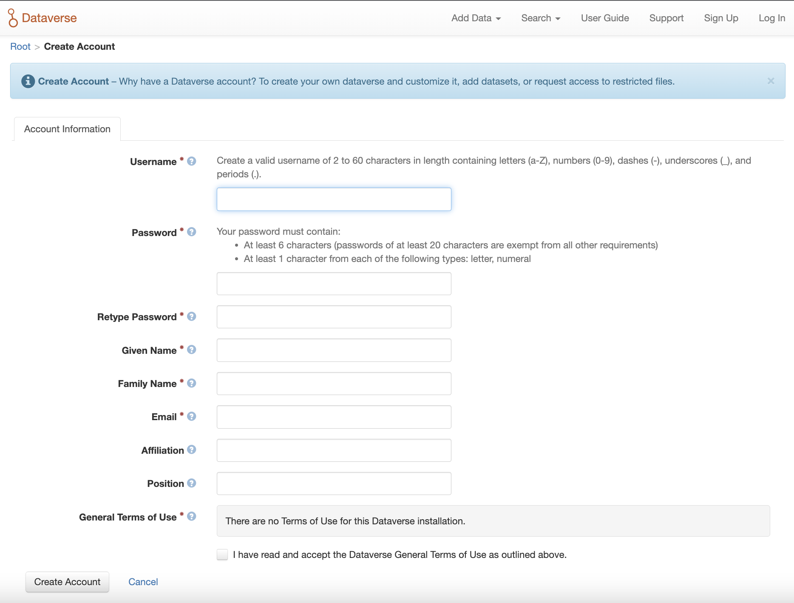

To create a Dataverse account with the Username/Email log in option, use the [Sign Up](https://dataverse.dsmlp.ucsd.edu/dataverseuser.xhtml?editMode=CREATE) page. Fill out the fields, and then click the ‘Create Account’ button.

 _Please note that the Username field does not support email addresses but will allow the following characters: a-Z, 0-9, _ (underscores), - (hyphens), and . (periods)._

### Edit Account
1. To edit your account after you have logged in, click on your account name in the header on the right hand side and click on Account Information.
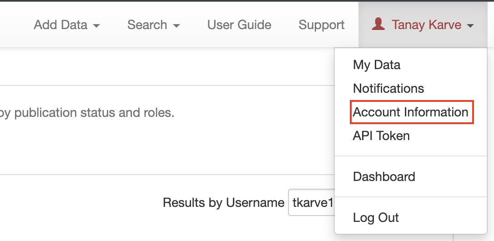


2. On the top right of your account page, click on the “Edit Account” button and from there you can select to edit either your Account Information or your Account Password.
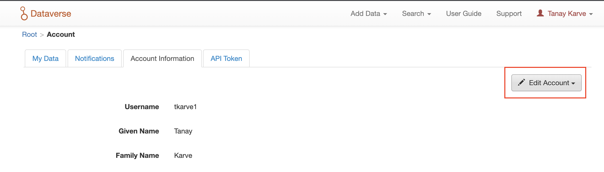

3. Select “Save Changes” when you are done.


## Finding Data
Without logging in to Dataverse, users can browse Dataverse, search for dataverses, datasets, and files, view dataset descriptions and files for published datasets, and subset, analyze, and visualize data for published (restricted & not restricted) data files. 

### Basic Search
You can search the entire contents of the Dataverse installation, including dataverses, datasets, and files. You can access the search by clicking the “Search” button in the header of every page. The search bar accepts search terms, queries, or exact phrases (in quotations).
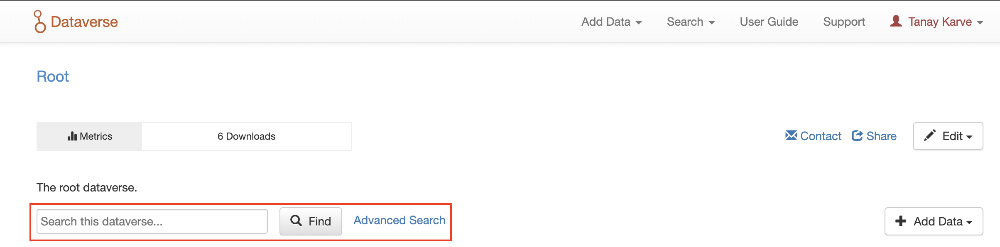

### Advanced Search
To perform an advanced search, click the “Advanced Search” link next to the search bar. 


There you will have the ability to enter search terms for dataverses, dataset metadata (citation and domain-specific), and file-level metadata. If you are searching for tabular data files you can also search at the variable level for name and label. To find out more about what each field searches, hover over the field name for a detailed description of the field.
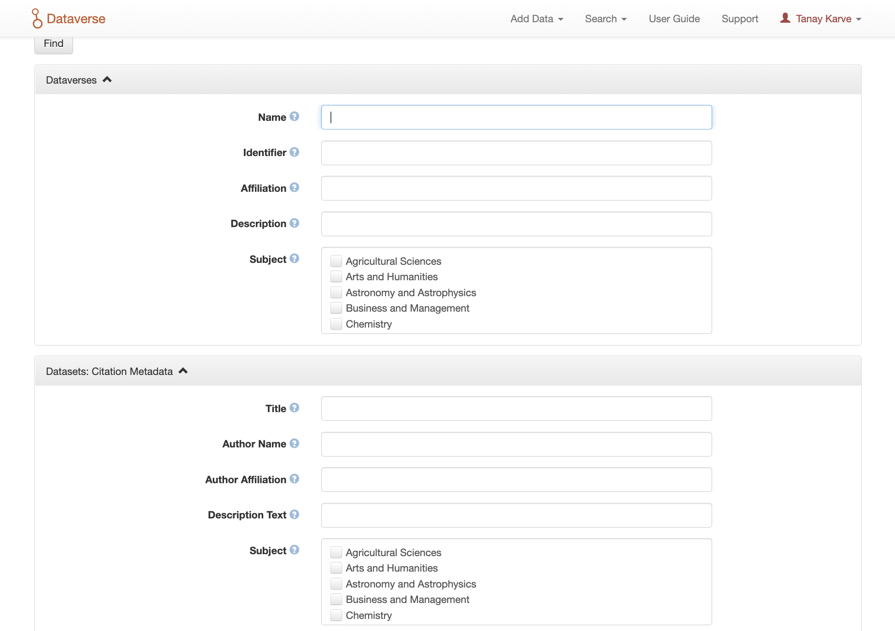


## Data Management
A dataverse is a container for datasets (research data, code, documentation, and metadata) and other dataverses, which can be setup for individual researchers, departments, journals and organizations.
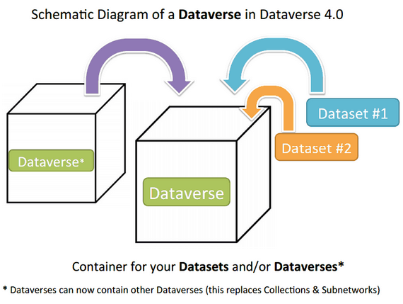
### Creating a Dataverse
Creating a dataverse is easy but first you must be a registered user Once you are logged in, click on the “Add Data” button, or “Add Data” navbar link and in the dropdown menu select “New Dataverse”.
1. Fill in the following fields on the “New Dataverse” page (required fields in the form are denoted by a red asterisk, next to the label):

    - Host Dataverse: Select a dataverse you would like to create the new dataverse in, by default the root dataverse is selected if you click the Add Data button from the root dataverse, your My Data pg, the Add Data link in the navbar, or the Add a dataset button on the custom homepage (if configured), but you can select any dataverse for which you the proper permissions to create dataverses.

    - Dataverse Name: Enter the name of your dataverse.

    - Affiliation: Add any affiliation that can be associated with this particular dataverse (e.g., project name, institute name, department name, journal name, etc). This is automatically filled out if you have added an affiliation for your user account.

    - Identifier: This is an abbreviation, usually lower-case, that becomes part of the URL for the new dataverse. Special characters (~,`, !, @, #, $, %, ^, &, and *) and spaces are not allowed. Note: if you change this field in the future, the URL for your Dataverse will change (http//.../’identifier’), which will break older links to the page.

    - Category: Select a category that best describes the type of dataverse this will be. For example, if this is a dataverse for an individual researcher’s datasets, select Researcher. If this is a dataverse for an institution, select Organization or Institution.

    - Email: This is the email address that will be used as the contact for this particular dataverse. You can have more than one contact email address for your dataverse.

    - Description: Provide a description of this dataverse. This will display on the landing page of your dataverse and in the search result list. The description field supports certain HTML tags, if you’d like to format your text ```(<a>, <b>, <blockquote>, <br>, <code>, <del>, <dd>, <dl>, <dt>, <em>, <hr>, <h1>-<h3>, <i>, , <kbd>, <li>, <ol>, <p>, <pre>, <s>, <sup>, <sub>, <strong>, <strike>, <u>, <ul>).```

2. Choose the sets of Metadata Fields for datasets in this dataverse:
    - By default the metadata elements will be from the host dataverse that this new dataverse is created in.
    - Dataverse offers metadata standards for multiple domains. To learn more about the metadata standards in Dataverse please check out the Appendix.
    - Metadata fields can be hidden, or selected as required or optional.
    - Selected metadata elements are also used to pick which metadata fields you would like to use for creating Dataset Templates: after you finish creating your dataverse.

3. Choose which metadata fields will be used as browse/search facets on your dataverse:
    - These facets will allow users browsing or searching your dataverse to filter its contents according to the fields you have selected. For example, if you select “Subject” as a facet, users will be able to filter your dataverse’s contents by subject area.
    - By default, the facets that will appear on your dataverse landing page will be from the host dataverse that this new dataverse was created in, but you can add or remove facets from this default.
4. Click the “Create Dataverse” button and you’re done!

### Edit Dataverse
To edit your dataverse, navigate to your dataverse’s landing page and select the “Edit Dataverse” button, where you will be presented with the following editing options:
1. General Information: edit name, affiliation, identifier, category, contact email, description, metadata fields, and browse/search facets for your dataverse

2. Theme: upload a logo for your dataverse, add a link to your department or personal website, add a custom footer image, and select colors for your dataverse in order to brand it
3. Widgets: get code to add to your website to have your dataverse display on it
4. Permissions: give Dataverse users permissions to your dataverse, i.e.-can edit datasets, and see which users already have which permissions for your dataverse
5. Dataset Templates: these are useful when you have several datasets that have the same information in multiple metadata fields that you would prefer not to have to keep manually typing in
6. Dataset Guestbooks: allows you to collect data about who is downloading the files from your datasets
7. Featured Dataverses: if you have one or more dataverses, you can use this option to show them at the top of your dataverse page to help others easily find interesting or important dataverses
8. Delete Dataverse: you are able to delete your dataverse as long as it is not published and does not have any draft datasets

### Dataset Linking
Dataset linking allows a dataverse owner to “link” their dataverse to a dataset that exists outside of that dataverse, so it appears in the dataverse’s list of contents without actually being in that dataverse. You can link other users’ datasets to your dataverse, but that does not transfer editing or other special permissions to you. The linked dataset will still be under the original user’s control.

For example, researchers working on a collaborative study across institutions can each link their own individual institutional dataverses to the one collaborative dataset, making it easier for interested parties from each institution to find the study.

In order to link a dataset, you will need your account to have the “Add Dataset” permission on the Dataverse that is doing the linking. If you created the dataverse then you should have this permission already, but if not then you will need to ask the admin of that dataverse to assign that permission to your account. You do not need any special permissions on the dataset being linked.

To link a dataset to your dataverse, you must navigate to that dataset and click the white “Link” button in the upper-right corner of the dataset page. This will open up a window where you can type in the name of the dataverse that you would like to link the dataset to. Select your dataverse and click the save button. This will establish the link, and the dataset will now appear under your dataverse.

There is currently no way to remove established links in the UI. If you need to remove a link between a dataverse and a dataset, please contact the support team for the Dataverse installation you are using.

### Publish

Once your dataverse is ready to go public, go to your dataverse page, click on the “Publish” button on the right hand side of the page. A pop-up will appear to confirm that you are ready to actually Publish, since once a dataverse is made public, it can no longer be unpublished.


## Dataset + File Management
A dataset in Dataverse is a container for your data, documentation, code, and the metadata describing this Dataset.

### Adding a new Dataset
1. Navigate to the dataverse in which you want to add a dataset.
2. Click on the “Add Data” button and select “New Dataset” in the dropdown menu. Note: If you are on the root dataverse, your My Data page or click the “Add Data” link in the navbar, the dataset you create will be hosted in the root dataverse. You can change this by selecting another dataverse you have proper permissions to create datasets in, from the Host Dataverse dropdown in the create dataset form. This option to choose will not be available after you create the dataset.
3. To quickly get started, enter at minimum all the required fields with an asterisk (e.g., the Dataset Title, Author, Description, Contact Email and Subject) to get a Data Citation with a DOI.
4. Scroll down to the “Files” section and click on “Select Files to Add” to add all the relevant files to your Dataset. You can also upload your files directly from your Dropbox. Tip: You can drag and drop or select multiple files at a time from your desktop directly into the upload widget. Your files will appear below the “Select Files to Add” button where you can add a description and tags (via the “Edit Tag” button) for each file. Additionally, an MD5 checksum will be added for each file. If you upload a tabular file a Universal Numerical Fingerprint (UNF) will be added to this file.
5. Click the “Save Dataset” button when you are done. Your unpublished dataset is now created.

### Restrict Files
When you restrict a file in Dataverse it cannot be downloaded unless permission has been granted.

If you restrict any files in your dataset, you will be prompted by a pop-up to enter Terms of Access for the data. This can also be edited in the Terms tab or selecting Terms in the “Edit” dropdown button in the dataset. You may also allow users to request access for your restricted files by enabling “Request Access”. To add more information about the Terms of Access, we have provided fields like Data Access Place, Availability Status, Contact for Access, etc. If you restrict a file, it will not have a preview shown on the file page.
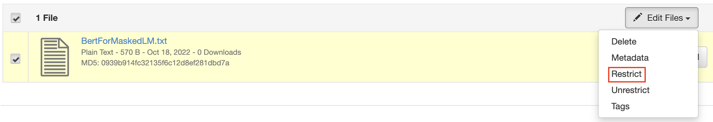
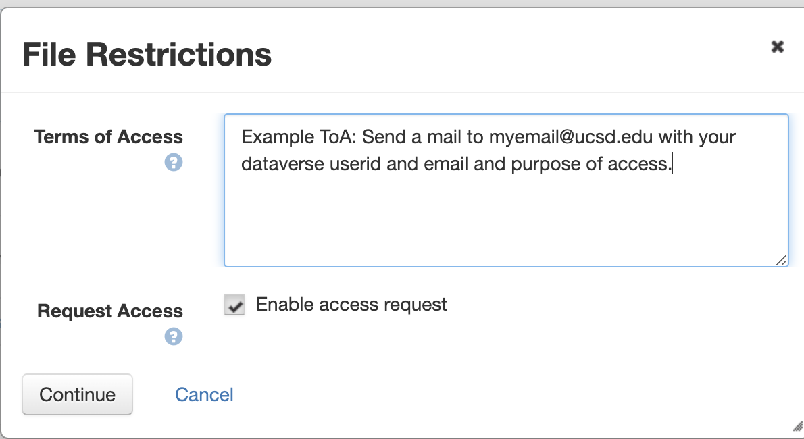

### Provide Access to Restricted Files
If you have the usernames of certain users, you can grant them access to restricted files.
1. Click on Edit > Permissions > File
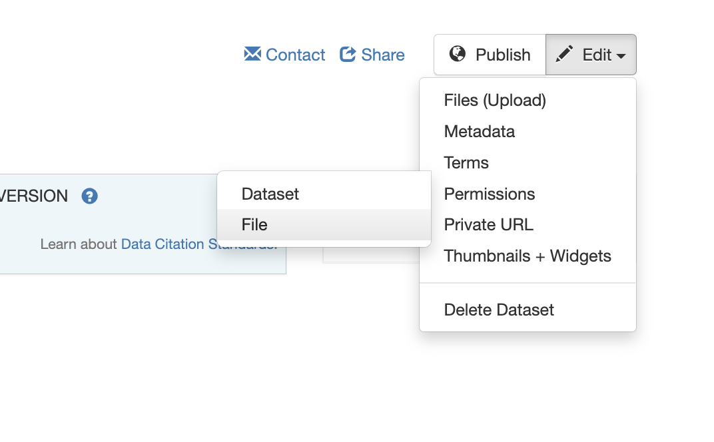
2. Select all Files that you want to provide access for. Then click Assign Access.
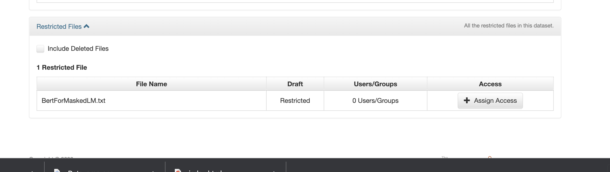
3. Enter usernames and click Grant.
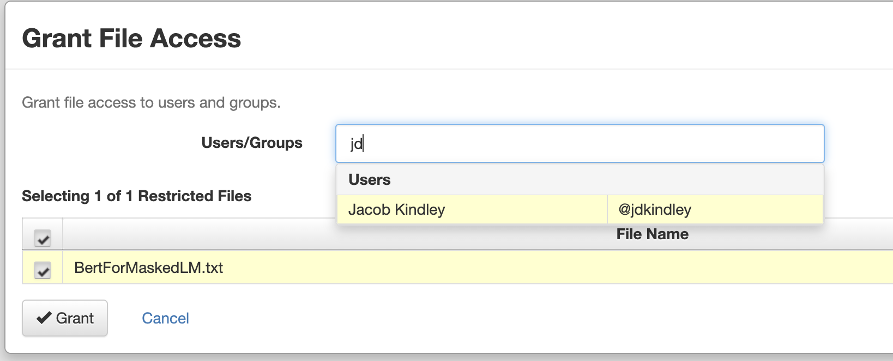


